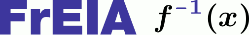

|Logo|

This is the **Fr**\ amework for **E**\ asily **I**\ nvertible **A**\ rchitectures (**FrEIA**).

* Construct Invertible Neural Networks (INNs) from simple invertible building blocks.
* Quickly construct complex invertible computation graphs and INN topologies.
* Forward and inverse computation guaranteed to work automatically.
* Most common invertible transforms and operations are provided.
* Easily add your own invertible transforms.

.. contents:: Table of contents
   :backlinks: top
   :local:

Papers
--------------

This repository contains code for the following papers. If you use the FrEIA for your research, please cite the appropriate one.

**"Guided Image Generation with Conditional Invertible Neural Networks" (2019)** 

https://arxiv.org/abs/1907.02392

Supplement found here: https://drive.google.com/file/d/1_OoiIGhLeVJGaZFeBt0OWOq8ZCtiI7li

* ``experiments/mnist_minimal_example`` contains code to produce class-conditional MNIST samples in <150 lines total
* ``experiments/colorization_minimal_example`` contains code to colorize LSUN bedrooms in <200 lines total
* ``experiments/colorization_cINN`` contains the full research code used to produce all colorization figures in the paper
* ``experiments/mnist_cINN`` contains the full research code used to produce all mnist figures in the paper

**"Analyzing inverse problems with invertible neural networks." (2018)** 

https://arxiv.org/abs/1808.04730

* ``experiments/toy_8-modes`` contains a jupyter notebook for the gaussian mixture example
* ``experiments/inverse_problems_science`` contains the research code used for the science problems
  (without the datasets, as these are published separately)

Installation
--------------

Dependencies
^^^^^^^^^^^^^^^^

Except for pytorch, any fairly recent version will probably work, 
these are just the confirmed ones:

+---------------------------+-------------------------------+
| **Package**               | **Version**                   |
+---------------------------+-------------------------------+
| Pytorch                   | 1.0.X                         |
+---------------------------+-------------------------------+
| Numpy                     | >= 1.15.0                     |
+---------------------------+-------------------------------+
| *Optionally for the experiments:*                         |
+---------------------------+-------------------------------+
| Matplotlib                | 2.2.3                         |
+---------------------------+-------------------------------+
| Visdom                    | 0.1.8.5                       |
+---------------------------+-------------------------------+
| Torchvision               | 0.2.1                         |
+---------------------------+-------------------------------+
| scikit-learn              | 0.20.3                        |
+---------------------------+-------------------------------+
| scikit-image              | 0.14.2                        |
+---------------------------+-------------------------------+
| Pillow                    | 6.0.0                         |
+---------------------------+-------------------------------+

Downloading + Installing
^^^^^^^^^^^^^^^^^^^^^^^^^^^

To just install the framework:

.. code:: sh

   pip install git+https://github.com/VLL-HD/FrEIA.git

For development:

.. code:: sh

   # first clone the repository
   git clone 'github.com/VLL-HD/FrEIA.git'
   # then install in development mode, so that changes don't require a reinstall
   cd FrEIA
   python setup.py develop

Documentation
^^^^^^^^^^^^^^^^^^^^^^^^^^^^^^

Besides the general tutorial below, the complete documentation is found in
the ``./docs/`` directory, or at 

https://vll-hd.github.io/FrEIA

Tutorial
----------------

Basic Concepts
^^^^^^^^^^^^^^^^
*"Why does FrEIA even exist? RealNVP can be implemented in \~100 lines of code!"*

That is correct, but the concept of INNs is more general:
For any computation graph, as long as each node in the graph is invertible, and
there are no loose ends, the entire computation is invertible. This is also
true if the operation nodes have multiple in- or outputs, e.g. concatenation
(*n* inputs, 1 output). So we need a framework that allows to **define an arbitrary computation graph,
consisiting of invertible operations.**

For example, consider wanting to implement some complicated new INN
architecture, with multiple in- and outputs, skip connections, a conditional part, ...:
|complicatedINN|

To allow efficient prototyping and experimentation with such architectures,
we need a framework that can perform the following tasks:

* As the inputs of operations depend on the outputs of others, we have to
  **infer the order of operations**, both for the forward and the inverse
  direction.
* The operators have to be initialized with the correct input-
  and output sizes in mind (e.g. required number of weights), i.e. we have to
  perform **shape inference** on the computation graph.
* During the computation, we have to **keep track of intermediate results**
  (edges in the graph) and store them until they are needed.
* We want to use **pytorch methods and tools**, such as ``.cuda()``,
  ``.state_dict()``, ``DataParallel()``, etc. on the entire computation graph,
  without worrying whether they work correctly or having to fix them.

Along with an interface to define INN computation graphs and invertible
operators within, these are the main tasks that ``FrEIA`` addresses.

Invertible Computation Graphs
^^^^^^^^^^^^^^^^^^^^^^^^^^^^^^

The building blocks of the INN computation graph are the nodes in it.
They are provided through the ``FrEIA.framework.Node`` class.
The computation graph is constructed by constructing each node, given its
inputs (defining one direction of the INN as the 'forward' computation).
More specifically:

* The ``Node``-subclass ``InputNode`` represents an input to the INN, and its constructor only
  takes the dimensions of the data (except the batch dimension). E.g. for a 32x32 RGB image:

  .. code:: python

   in1 = InputNode(3, 32, 32, name='Input x_1')

  The ``name`` argument can be omitted in principle, but it is recommended in
  general, as it appears e.g. in error messages.

* Each ``Node`` (and derived classes) has properties ``node.out0``,
  ``node.out1``, etc., depending on its number of outputs.
  Instead of ``node.out{i}``, it is equivalent to use a tuple ``(node, i)``,
  which is useful if you e.g. want to loop over 10 outputs of a node.

* Each ``Node`` is initialized given a list of its inputs as the first
  constructor argument, along with other arguments covered later (omitted as
  '``...``' in the following, in particular defining what operation the node
  should represent). For transform *T1* in the example above, this would look
  like the this:

  .. code:: python

    transf1 = Node([in1.out0], ..., name='Transform T_1')

  Or for merge *m2*:

  .. code:: python

    merge2 = Node([transf3.out0, split2.out1], ..., name='Merge m_2')

  Conditions are passed as a list through the ``conditions`` argument:

  .. code:: python

    transf3 = Node([merge1.out0], ..., conditions=[cond], name='Transform T_3')

* The ``Node``-subclass ``OutputNode`` is used for the outputs. The INN as a whole
  will return the result at this node.
* Conditions (as in the cINN paper) are represented by ``ConditionNode``, whose
  constructor is identical to the ``InputNode``.
* Take note of several features for convenience (also see examples below): 1.)
  If a preceding node only has a single output, it is also equivalent to
  directly use ``node`` instead of ``node.out0`` in the constructor of
  following nodes.  2.) If a node only takes a sinlge input/condition, you can
  directly use only that input in the constructor instead of a list, i.e.
  ``node.out0`` instead of ``[node.out0]``.
* From the list of nodes, the INN is represented by the class
  ``FrEIA.framework.ReversibleGraphNet``. The constructor takes a list of all
  the nodes in the INN (order irrelevant), and an optional ``verbose`` argument
  (``True`` by default. If ``verbose``, the results of the shape inference as
  well as the in/outputs of each node are printed to stdout.)
* The ``ReversibleGraphNet`` is a subclass of ``torch.nn.Module``, and can be
  used like any other torch ``Module``.
  For the computation, the inputs are given as a list of torch tensors, or just
  a single torch tensor if there is only one input. To perform the inverse pass,
  the ``rev`` argument has to be set to ``True`` (see examples).

Using these rules, we would construct the INN from the above example in the
following way:

  .. code:: python

   in1 = InputNode(3, 32, 32, name='Input x_1') # 3-channel image
   in2 = InputNode(128, name='Input x_2') # 1D vector
   cond = ConditionNode(42, name='Condition c')

   transf1 = Node([in1.out0], ..., name='Transform T_1')
   split1 =  Node([transf1.out0], ..., name='Split s_1')
   split2 =  Node([split1.out0], ..., name='Split s_2')
   transf2 = Node([split2.out0], ..., name='Transform T_2')
   merge1 =  Node([transf2.out0, in2.out0], ..., name='Merge m_1')
   transf3 = Node([merge1.out0], ..., conditions=[cond], name='Transform T_3')
   merge2 =  Node([transf2.out0, split2.out1], ..., name='Merge m_2')

   output1 = Node([split1.out1], ..., name='Output z_1')
   output2 = Node([merge2.out0], ..., name='Output z_2')

   example_INN = ReversibleGraphNet([in1, in2, output1, output2, cond,
                                     transf1, transf2, transf3,
                                     merge1, merge2, split1, split2], verbose=False)

   # dummy inputs:
   x1, x2, cond = torch.randn(1,3,32,32), torch.randn(1, 128), torch.randn(1, 42)

   # compute the outputs
   z1, z2 = example_INN([x1, x2], c=cond)

   # invert the network and check if we get the original inputs back:
   x1_inv, x2_infv = example_INN([z1, z2], c=cond, rev=True)
   assert (torch.max(torch.abs(x1_inv - x1)) < 1e-5
           and torch.max(torch.abs(x2_inv - x2)) < 1e-5)

Node Construction
^^^^^^^^^^^^^^^^^^^

Above, we only covered the construction of the computation graph itself, but so
far we have not shown how to define the operations represented by each node.
Therefore, we will take a closer look at the ``Node`` constructor and its
arguments:

.. code:: python

   Node(inputs, module_type, module_args, conditions=[], name=None)

General API
******************
The arguments of the ``Node`` constructor are the following:

* ``inputs``: A list of outputs of other nodes, that are used as inputs for
  this node (discussed above)
* ``module_type``: This argument gives the class of operation to be performed by this node,
  for example ``GLOWCouplingBlock`` for a coupling block following the GLOW-design.
  Many implemented classes can be found in the documentation under
  https://vll-hd.github.io/FrEIA/modules/index.html
* ``module_args``: This argument is a dictionary. It provides arguments for the
  ``module_type``-constructor. For instance, a random invertible permutation
  (``module_type=PermuteLayer``) only has one argument ``seed``, so we could use
  ``module_args={'seed':111}``.

Affine Coupling Blocks
**************************

All coupling blocks (GLOW, RNVP, NICE), merit special discussion, because
they are the most used invertible transforms.

* The coupling blocks contain smaller feed-forward subnetworks predicting the affine coefficients.
  The in- and output shapes of the subnetworks depend on the in- output size of the coupling block itself.
  These size are not known when coding the INN (or perhaps can be worked out by
  hand, but would have to be worked out anew every time the architecture is modified slightly).
  Therefore, the subnetworks can not be directly passed as ``nn.Modules``, but
  rather in the form of a function or class, that constructs the subnetworks
  given in- and output size. This is a lot simpler than it sounds, for a fully connected subnetwork we could use e.g.
  
  .. code:: python

   def fc_constr(c_in, c_out):
       return nn.Sequential(nn.Linear(c_in, 128), nn.ReLU(),
                            nn.Linear(128,  128), nn.ReLU(),
                            nn.Linear(128,  c_out))

   transf1 = Node([in1.out0], GLOWCouplingBlock,
                  {'subnet_constructor':fc_constr},
                  name='Transform T_1')

* The RNVP and GLOW coupling blocks have an additional hyperparameter ``clamp``.
  This is becuase, instead of the exponential function ``exp(s)``, we use ``exp( 2*c/pi * atan(x))``
  in the coupling blocks (``clamp``-parameter ``c``).
  This leads to much more stable training and enables larger learning rates.
  Effecively, the mutliplication component of the coupling block is limited between ``exp(c)`` and ``1/exp(c)``.
  The Jacobian determinant is thereby limited between ``±D*c`` (dimensionaltiy of data ``D``).
  In general, ``clamp = 2.0`` is a good place to start:

  .. code:: python

   transf1 = Node([in1.out0], GLOWCouplingBlock,
                  {'subnet_constructor':fc_constr, 'clamp':2.0},
                  name='Transform T_1')

Examples
^^^^^^^^^^^^

If you want full examples with training code etc., look through the experiments folder.
The following only provides examples for constructing INNs by themselves.

.. code:: python

   # These imports and declarations apply to all examples
   import torch.nn as nn

   import FrEIA.framework as Ff
   import FrEIA.modules as Fm

   def subnet_fc(c_in, c_out):
       return nn.Sequential(nn.Linear(c_in, 512), nn.ReLU(),
                            nn.Linear(512,  c_out))

   def subnet_conv(c_in, c_out):
       return nn.Sequential(nn.Conv2d(c_in, 256,   3, padding=1), nn.ReLU(),
                            nn.Conv2d(256,  c_out, 3, padding=1))

   def subnet_conv_1x1(c_in, c_out):
       return nn.Sequential(nn.Conv2d(c_in, 256,   1), nn.ReLU(),
                            nn.Conv2d(256,  c_out, 1))

Simple GLOW-based INN
**************************

The following INN only has 2 input dimensions.
It should be able to learn to generate most 2D distributions (gaussian mixtures, different shapes, ...),
and can be easily visualized.
Because of the 2D, it does not require permutations or orthogonal transforms between coupling blocks.

.. code:: python

   nodes = [Ff.InputNode(2, name='input')]

   # Use a loop to produce a chain of coupling blocks
   for k in range(8):
       nodes.append(Ff.Node(nodes[-1],
                            Fm.GLOWCouplingBlock,
                            {'subnet_constructor':subnet_fc, 'clamp':2.0},
                            name=F'coupling_{k}'))

   nodes.append(Ff.OutputNode(nodes[-1], name='output'))
   inn = Ff.ReversibleGraphNet(nodes)

Conditional INN
************************

The following INN is able to perform conditional MNIST generation quite well.
Note that is is not particularly efficient, with respect to the number of parameters.
(See convolutional INN for that)

.. code:: python

   cond = Ff.ConditionNode(10, name='condition')
   nodes = [Ff.InputNode(28*28, name='input')]

   for k in range(12):
       nodes.append(Ff.Node(nodes[-1],
                            Fm.GLOWCouplingBlock,
                            {'subnet_constructor':subnet_fc, 'clamp':2.0},
                            conditions=cond,
                            name=F'coupling_{k}'))
       nodes.append(Ff.Node(nodes[-1],
                            Fm.PermuteRandom,
                            {'seed':k},
                            name=F'permute_{k}'))

   nodes.append(Ff.OutputNode(nodes[-1], name='output'))
   cinn = Ff.ReversibleGraphNet(nodes + [cond])

Convolutional INN
************************

For the following architecture (which works e.g. for CIFAR10), 3/4 of the
outputs are split off after some convolutions, which encode the local details,
and the rest are transformed further to encode semantic content.  This is
important, because even for moderately sized images, it becomes infeasible to
transform all dimenions through the full depth of the INN. Many dimensions will
just enocde image noise, so we can split them off early.

.. code:: python

   nodes = [Ff.InputNode(3, 32, 32, name='input')]
   ndim_x = 3 * 32 * 32

   # Higher resolution convolutional part
   for k in range(4):
      nodes.append(Ff.Node(nodes[-1],
                           Fm.GLOWCouplingBlock,
                           {'subnet_constructor':subnet_conv, 'clamp':1.2},
                           name=F'conv_high_res_{k}'))
      nodes.append(Ff.Node(nodes[-1],
                           Fm.PermuteRandom,
                           {'seed':k},
                           name=F'permute_high_res_{k}'))

   nodes.append(Ff.Node(nodes[-1], Fm.IRevNetDownsampling, {}))

   # Lower resolution convolutional part
   for k in range(12):
      if k%2 == 0:
          subnet = subnet_conv_1x1
      else:
          subnet = subnet_conv

      nodes.append(Ff.Node(nodes[-1],
                           Fm.GLOWCouplingBlock,
                           {'subnet_constructor':subnet, 'clamp':1.2},
                           name=F'conv_low_res_{k}'))
      nodes.append(Ff.Node(nodes[-1],
                           Fm.PermuteRandom,
                           {'seed':k},
                           name=F'permute_low_res_{k}'))

   # Make the outputs into a vector, then split off 1/4 of the outputs for the
   # fully connected part
   nodes.append(Ff.Node(nodes[-1], Fm.Flatten, {}, name='flatten'))
   split_node = Ff.Node(nodes[-1],
                        Fm.Split1D,
                        {'split_size_or_sections':(ndim_x // 4, 3 * ndim_x // 4), 'dim':0},
                        name='split')
   nodes.append(split_node)

   # Fully connected part
   for k in range(12):
      nodes.append(Ff.Node(nodes[-1],
                           Fm.GLOWCouplingBlock,
                           {'subnet_constructor':subnet_fc, 'clamp':2.0},
                           name=F'fully_connected_{k}'))
      nodes.append(Ff.Node(nodes[-1],
                           Fm.PermuteRandom,
                           {'seed':k},
                           name=F'permute_{k}'))

   # Concatenate the fully connected part and the skip connection to get a single output
   nodes.append(Ff.Node([nodes[-1].out0, split_node.out1],
                        Fm.Concat1d, {'dim':0}, name='concat'))
   nodes.append(Ff.OutputNode(nodes[-1], name='output'))

   conv_inn = Ff.ReversibleGraphNet(nodes)

Useful Tips & Engineering Heuristics
^^^^^^^^^^^^^^^^^^^^^^^^^^^^^^^^^^^^^^^^^^

* Stochastic gradient descent will not work (well) for INNs. Use e.g. Adam instead.
* Gradient clipping can be useful if you are experiencing training instabilities, e.g. use ``torch.nn.utils.clip_grad_norm_``
* Add some slight noise to the inputs (order of 1E-2). This stabilizes training and prevents sparse gradients,
  if there are some quantized or perfectly correlated input dimenions

For coupling blocks in particular:

* Use Xavier initialization for the weights. This prevents unstable training at the start.
* If your network is very deep (>30 coupling blocks), initialize the last layer in the subnetworks to zero.
  This means the INN as a whole is initialized to the identity, and you will not get NaNs at the first iteration.
* Do not forget permutations/orthogonal transforms between coupling blocks.
* Keep the subnetworks shallow (2-3 layers only), but wide (>= 128 neurons/ >= 64 conv. channels)
* Keep in mind that one coupling block contains between 4 and 12 individual convolutions or fully connected layers.
  So you may not have to use as many as you think, else the number of parameters will be huge.
* This being said, as the coupling blocks initialize to roughly the identity transform,
  it is hard to have too many coupling blocks and break the training completely
  (as opposed to a standard feed-forward NN).

For convolutional INNs in particular:

* Perform some kind of reshaping early, so the INN has >3 channels to work with
* Coupling blocks using 1x1 convolutions in the subnets seem important for the quality,
  they should constitute every other, or every third coupling block

.. |complicatedINN| image:: docs/inn_example_architecture.png
                            :scale: 60

