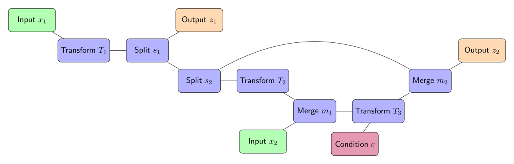

Computation graph API
=====================================

The building blocks of the INN computation graph are the nodes in it.
They are provided through the ``FrEIA.framework.Node`` class.
The computation graph is constructed by constructing each node, given its
inputs (defining one direction of the INN as the 'forward' computation).
More specifically:

* The ``Node``-subclass ``InputNode`` represents an input to the INN, and its constructor only
  takes the dimensions of the data (except the batch dimension). E.g. for a 32x32 RGB image:

  .. code:: python

   in1 = InputNode(3, 32, 32, name='Input 1')

  The ``name`` argument can be omitted in principle, but it is recommended in
  general, as it appears e.g. in error messages.

* Each ``Node`` (and derived classes) has properties ``node.out0``,
  ``node.out1``, etc., depending on its number of outputs.
  Instead of ``node.out{i}``, it is equivalent to use a tuple ``(node, i)``,
  which is useful if you e.g. want to loop over 10 outputs of a node.

* Each ``Node`` is initialized given a list of its inputs as the first
  constructor argument, along with other arguments covered later (omitted as
  '``...``' in the following, in particular defining what operation the node
  should represent). For *Permutation* in the example above, this would look
  like the this:

  .. code:: python

    perm = Node([in1.out0], ..., name='Permutation')

  Or for *Merge 2*:

  .. code:: python

    merge2 = Node([affine.out0, split2.out1], ..., name='Merge 2')

  Conditions are passed as a list through the ``conditions`` argument:

  .. code:: python

    affine = Node([merge1.out0], ..., conditions=[cond], name='Affine Coupling')

* The ``Node``-subclass ``OutputNode`` is used for the outputs. The INN as a whole
  will return the result at this node.
* Conditions (as in the cINN paper) are represented by ``ConditionNode``, whose
  constructor is identical to the ``InputNode``.
* Take note of several features for convenience (also see examples below): 1.)
  If a preceding node only has a single output, it is also equivalent to
  directly use ``node`` instead of ``node.out0`` in the constructor of
  following nodes.  2.) If a node only takes a sinlge input/condition, you can
  directly use only that input in the constructor instead of a list, i.e.
  ``node.out0`` instead of ``[node.out0]``.
* From the list of nodes, the INN is represented by the class
  ``FrEIA.framework.GraphINN``. The constructor takes a list of all
  the nodes in the INN (order irrelevant).
* The ``GraphINN`` is a subclass of ``torch.nn.Module``, and can be
  used like any other torch ``Module``.
  For the computation, the inputs are given as a list of torch tensors, or just
  a single torch tensor if there is only one input. To perform the inverse pass,
  the ``rev`` argument has to be set to ``True`` (see examples).

Above, we only covered the construction of the computation graph itself, but so
far we have not shown how to define the operations represented by each node.
Therefore, we will take a closer look at the ``Node`` constructor and its
arguments:

.. code:: python

  Node(inputs, module_type, module_args, conditions=[], name=None)

The arguments of the ``Node`` constructor are the following:

* ``inputs``: A list of outputs of other nodes, that are used as inputs for
  this node (discussed above)
* ``module_type``: This argument gives the class of operation to be performed by this node,
  for example ``GLOWCouplingBlock`` for a coupling block following the GLOW-design.
  Many implemented classes can be found in the documentation under
  https://vll-hd.github.io/FrEIA/modules/index.html
* ``module_args``: This argument is a dictionary. It provides arguments for the
  ``module_type``-constructor. For instance, a random invertible permutation
  (``module_type=PermuteRandom``) can accept the argument ``seed``, so we could use
  ``module_args={'seed': 111}``.
  If no arguments are specified we must pass an empty dictionary ``{}``.

Using these rules, we would construct the INN from the example 
in the *Basic concepts* section:
|complicatedINN|

.. code:: python

  in1 = Ff.InputNode(100, name='Input 1') # 1D vector
  in2 = Ff.InputNode(20, name='Input 2') # 1D vector
  cond = Ff.ConditionNode(42, name='Condition')

  def subnet(dims_in, dims_out):
      return nn.Sequential(nn.Linear(dims_in, 256), nn.ReLU(),
                           nn.Linear(256, dims_out))

  perm = Ff.Node(in1, Fm.PermuteRandom, {}, name='Permutation')
  split1 =  Ff.Node(perm, Fm.Split, {}, name='Split 1')
  split2 =  Ff.Node(split1.out1, Fm.Split, {}, name='Split 2')
  actnorm = Ff.Node(split2.out1, Fm.ActNorm, {}, name='ActNorm')
  concat1 =  Ff.Node([actnorm.out0, in2.out0], Fm.Concat, {}, name='Concat 1')
  affine = Ff.Node(concat1, Fm.AffineCouplingOneSided, {'subnet_constructor': subnet},
                   conditions=cond, name='Affine Coupling')
  concat2 =  Ff.Node([split2.out0, affine.out0], Fm.Concat, {}, name='Concat 2')

  output1 = Ff.OutputNode(split1.out0, name='Output 1')
  output2 = Ff.OutputNode(concat2, name='Output 2')

  example_INN = Ff.GraphINN([in1, in2, cond,
                             perm, split1, split2,
                             actnorm, concat1, affine, concat2,
                             output1, output2])

  # dummy inputs:
  x1, x2, c = torch.randn(1, 100), torch.randn(1, 20), torch.randn(1, 42)

  # compute the outputs
  (z1, z2), log_jac_det = example_INN([x1, x2], c=c)

  # invert the network and check if we get the original inputs back:
  (x1_inv, x2_inv), log_jac_det_inv = example_INN([z1, z2], c=c, rev=True)
  assert (torch.max(torch.abs(x1_inv - x1)) < 1e-5
         and torch.max(torch.abs(x2_inv - x2)) < 1e-5)

